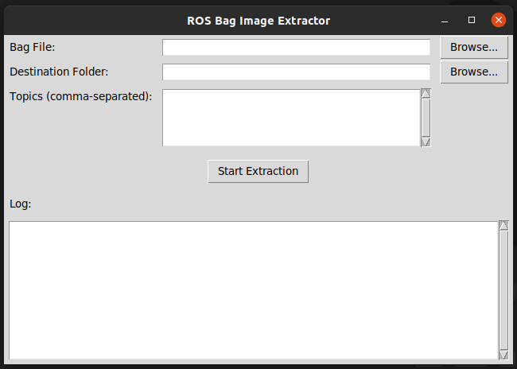

# rosbag_tools

This repo contains various tools for dealing with rosbags. Right now, these tools support ROS Noetic.

## Extracting image frames from bag topics 

**NOTE:** The rosbag does *not* have to be playing for these tools to work. 

### Script

Run: `python /rosbag_images_tool.py /location_of_bag /topic_name /destination_of_extracted_frames`.

### GUI

Run: `rosbag_images_gui.py`. 
Features: 
- Graphical interface.
- Can specify multiple topics.
- Fast.

    

## Creating videos from extracted frames

Will update this later. 

## Removing bad frames

Will update this later. 
